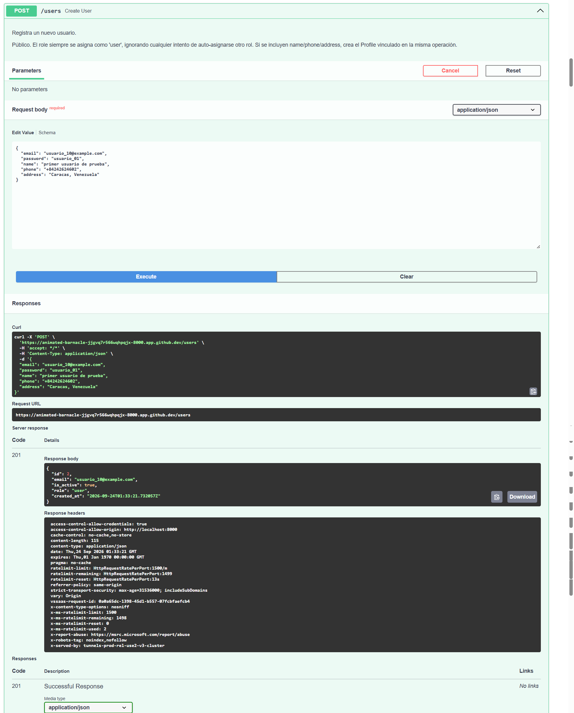
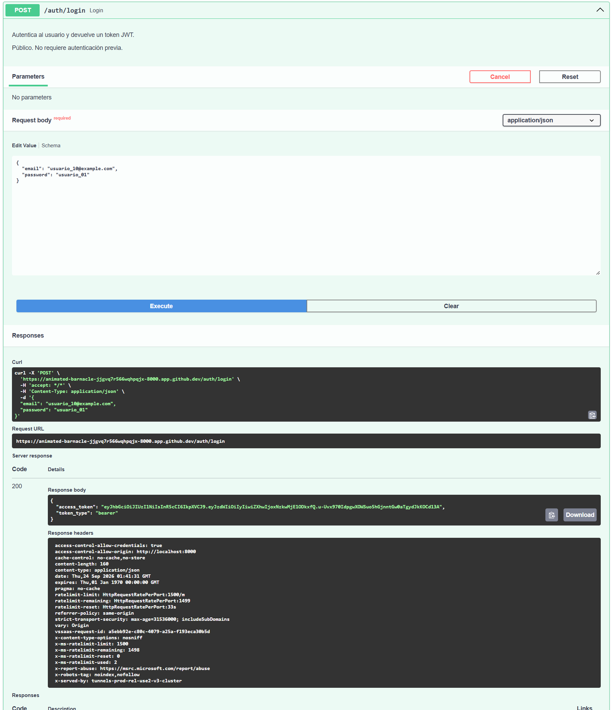
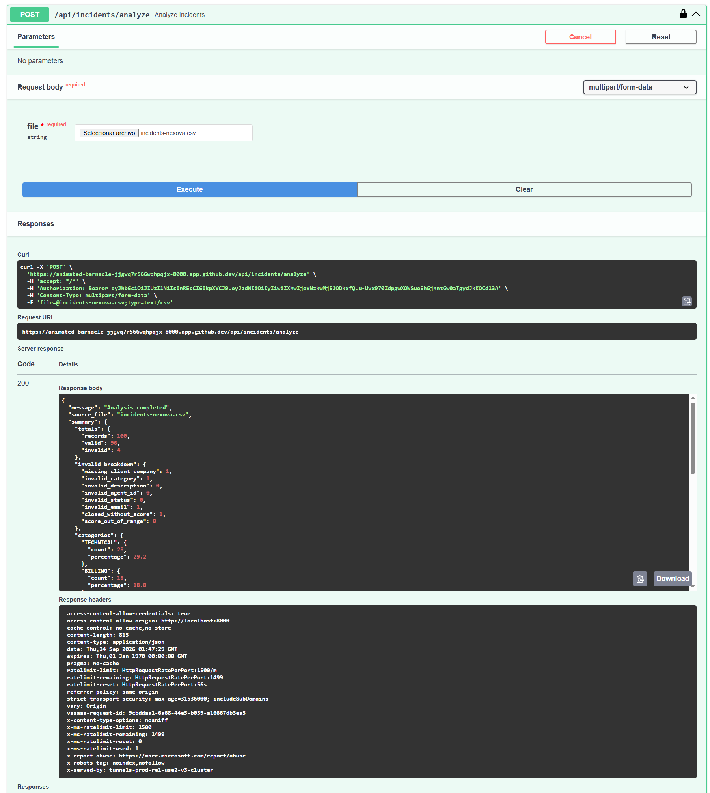

# Auditoría de Serialización del Backend

> **Fecha:** 2026-09-22
> **Versión API:** 1.3.0 (Nexova Operations API)
> **Alcance:** Todos los endpoints registrados en `main.py`

---

## Resumen ejecutivo

La API se encuentra en un estado **avanzado de serialización**. La mayoría de endpoints ya declaran `response_model` explícito con esquemas Pydantic bien definidos. No se detectaron endpoints que devuelvan objetos ORM en crudo. Sin embargo, existen oportunidades de optimización en endpoints de listado (over-fetching) y en un endpoint no tipado (`POST /api/incidents/analyze`).

| Estado | Cantidad | Nota |
|--------|----------|------|
| ✅ Ya serializado | 23 | Tras Fase 2: `POST /api/incidents/analyze` sube de ⚠️ a ✅ |
| ⚠️ Parcialmente serializado | 2 | (se excluyeron puntos 1 y 2 por decisión del proyecto) |
| ❌ Sin serializar | 0 |

---

## Clasificación por módulo

---

### 🔐 Auth (`/auth`)

| # | Endpoint | Método | Estado | Response actual | Observaciones |
|---|----------|--------|--------|-----------------|---------------|
| 1 | `/auth/login` | POST | ✅ | `Token` (access_token, token_type) | Esquema mínimo correcto. No expone contraseñas ni email. |
| 2 | `/auth/forgot-password` | POST | ✅ | `PasswordActionResponse` (message) | Mensaje genérico. No revela existencia de la cuenta. |
| 3 | `/auth/reset-password` | POST | ✅ | `PasswordActionResponse` (message) | Esquema correcto. |
| 4 | `/auth/change-password` | POST | ✅ | `PasswordActionResponse` (message) | Esquema correcto. |
| 5 | `/auth/me` | GET | ✅ | `AuthMeResponse` (email, role, profile) | Devuelve email del propio llamante — permitido por la especificación. |

**Análisis de seguridad:** Ninguna ruta de auth expone `hashed_password`. Las rutas no autenticadas (login, forgot-password, reset-password) no reenvían el email en la respuesta. ✅

**Mejora opcional:** Ninguna.

---

### 👤 Users (`/users`)

| # | Endpoint | Método | Estado | Response actual | Observaciones |
|---|----------|--------|--------|-----------------|---------------|
| 6 | `/users` | POST | ✅ | `UserResponse` (id, email, is_active, role, created_at) | No expone contraseña. Crea profile opcional en la misma operación. |
| 7 | `/users` | GET | ✅ | `list[UserResponse]` | Listado completo con esquema bien definido. |
| 8 | `/users/{user_id}` | GET | ✅ | `UserResponse` | Vista de detalle con esquema explícito. |
| 9 | `/users/{user_id}` | PUT | ✅ | `UserResponse` | Actualización con esquema explícito. |
| 10 | `/users/{user_id}` | DELETE | ✅ | `dict[str, str]` | Retorna `{"message": "User deleted."}` — respuesta minimalista aceptable. |

**Análisis de campos sensibles:** `UserResponse` no incluye `hashed_password` ni ningún campo interno de TinyDB. ✅

**Mejora opcional:** El endpoint `GET /users` (listado) y `GET /users/{user_id}` (detalle) usan el mismo `UserResponse`. Si el listado se usa solo para mostrar una tabla con email/role/status, el esquema es adecuado. Si se quisiera aún más ligero, se podría crear un `UserListItem` excluyendo `created_at`, pero no es necesario.

---

### 👤 Profiles (`/profiles`)

| # | Endpoint | Método | Estado | Response actual | Observaciones |
|---|----------|--------|--------|-----------------|---------------|
| 11 | `/profiles/me` | GET | ✅ | `ProfileResponse` (id, user_id, name, phone, address) | Esquema explícito correcto. |
| 12 | `/profiles/me` | PUT | ✅ | `ProfileResponse` | Esquema explícito correcto. |

**Mejora opcional:** Ninguna.

---

### 📦 Suppliers (`/suppliers`)

| # | Endpoint | Método | Estado | Response actual | Observaciones |
|---|----------|--------|--------|-----------------|---------------|
| 13 | `/suppliers` | POST | ✅ | `SupplierResponse` | Crea con `SupplierCreate`, responde con `SupplierResponse`. |
| 14 | `/suppliers` | GET | ⚠️ | `list[SupplierResponse]` | Usa el mismo esquema que detalle. Para un listado, devuelve campos que probablemente no necesita la UI (`notes`, `updated_at`, `contract_renewal_date`). **Propuesta:** crear un `SupplierListItem` más ligero. |
| 15 | `/suppliers/{supplier_id}` | GET | ✅ | `SupplierResponse` | Vista de detalle — necesita todos los campos. Correcto. |
| 16 | `/suppliers/{supplier_id}/rate` | PATCH | ✅ | `SupplierResponse` | Actualización parcial con esquema dedicado de entrada (`SupplierRateUpdate`). |
| 17 | `/suppliers/{supplier_id}/status` | PATCH | ✅ | `SupplierResponse` | Actualización parcial con esquema dedicado de entrada (`SupplierStatusUpdate`). |
| 18 | `/suppliers/{supplier_id}` | DELETE | ✅ | `dict[str, str]` | Retorna `{"message": "Supplier deleted."}` — respuesta minimalista aceptable. |

**Análisis de over-fetching:** ⚠️ `GET /suppliers` (listado) devuelve todos los campos de `SupplierResponse`, incluyendo `notes`, `updated_at` y `contract_renewal_date`. Para una tabla de listado, el frontend probablemente solo necesita: `id`, `name`, `country`, `categories`, `monthly_rate`, `currency`, `status`. Se recomienda crear un esquema ligero `SupplierListItem`.

**Esquemas de entrada:** ✅ `SupplierCreate`, `SupplierRateUpdate` y `SupplierStatusUpdate` son esquemas de entrada separados y minimalistas — solo aceptan los campos necesarios.

---

### 🚨 Incidents (`/api/incidents`)

| # | Endpoint | Método | Estado | Response actual | Observaciones |
|---|----------|--------|--------|-----------------|---------------|
| 19 | `/api/incidents` | POST | ✅ | `IncidentResponse` | Esquema explícito. No devuelve campos internos de TinyDB. |
| 20 | `/api/incidents` | GET | ⚠️ | `list[IncidentResponse]` | Usa el mismo esquema que detalle. Para listados largos, `description` puede ser un campo pesado que no siempre necesita la UI. **Propuesta:** considerar `IncidentListItem` sin `description` si el frontend solo muestra título + estado. |
| 21 | `/api/incidents/summary` | GET | ✅ | `IncidentSummary` | Esquema agregado explícito con counts agrupados. Correcto. |
| 22 | `/api/incidents/health` | GET | ✅ | `dict[str, str]` | Health check — respuesta mínima aceptable. |
| 23 | `/api/incidents/{incident_id}/status` | PATCH | ✅ | `IncidentResponse` | Actualización parcial con esquema de entrada dedicado (`IncidentStatusUpdate`). |
| 24 | `/api/incidents/{incident_id}` | GET | ✅ | `IncidentResponse` | Vista de detalle con esquema explícito. |
| 25 | `/api/incidents/analyze` | POST | ✅ | `AnalysisResponse` (message, source_file, summary) | Se creó `AnalysisResponse` en `services/api/models.py` con `message: str`, `source_file: str`, `summary: dict[str, object]`. El endpoint ahora declara `response_model=AnalysisResponse`. |
| 26 | `/api/incidents/results/export` | GET | ✅ | `Response` (CSV) | Endpoint de descarga de archivo — no aplica response_model JSON. Correcto. |

**Análisis de over-fetching:** ⚠️ `GET /api/incidents` devuelve `IncidentResponse` completo, que incluye `description`. Si el listado de incidencias en la UI solo muestra título, categoría, estado y fecha, `description` es tráfico innecesario.

**Endpoint analyze:** ✅ Se creó el modelo `AnalysisResponse` y el endpoint ahora declara `response_model=AnalysisResponse`. El `summary` se tipa como `dict[str, object]` porque la estructura devuelta por `result_to_summary_dict()` (totals, categories, statuses, satisfaction) no coincide con `IncidentSummary`.

**Esquemas de entrada:** ✅ `IncidentCreate` usa `extra="forbid"` para rechazar campos inesperados. `IncidentStatusUpdate` también usa `extra="forbid"`. Correcto.

---

### 📦 Inventory (`/inventory`)

| # | Endpoint | Método | Estado | Response actual | Observaciones |
|---|----------|--------|--------|-----------------|---------------|
| 27 | `/inventory/products` | GET | ✅ | `list[AssetResponse]` | Esquema dedicado con `current_stock` calculado. No expone campos ORM internos. |
| 28 | `/inventory/products` | POST | ✅ | `AssetResponse` | Esquema de entrada `AssetCreate` separado del de respuesta. |
| 29 | `/inventory/products/{asset_id}` | GET | ✅ | `AssetResponse` | Vista de detalle con esquema explícito. |
| 30 | `/inventory/orders/inbound` | POST | ✅ | `AssetEntryResponse` | Esquema de entrada `AssetEntryCreate` separado del de respuesta. |
| 31 | `/inventory/orders/outbound` | POST | ✅ | `AssetExitResponse` | Esquema de entrada `AssetExitCreate` separado con validaciones. |
| 32 | `/inventory/orders` | GET | ✅ | `list[OrderResponse]` | Esquema combinado que aplana datos de Asset + Entry/Exit. Evita N+1 con joins explícitos. Bien diseñado. |

**Análisis general:** El módulo de inventario es el mejor serializado. Sus esquemas están en un archivo separado (`schemas.py`) con la declaración explícita: "Ningún endpoint devuelve un objeto SQLModel directamente." ✅

---

## Tabla completa de todos los endpoints

| # | Ruta | Método | Estado | Response model | Notas |
|---|------|--------|--------|----------------|-------|
| 1 | `/auth/login` | POST | ✅ | `Token` | |
| 2 | `/auth/forgot-password` | POST | ✅ | `PasswordActionResponse` | |
| 3 | `/auth/reset-password` | POST | ✅ | `PasswordActionResponse` | |
| 4 | `/auth/change-password` | POST | ✅ | `PasswordActionResponse` | |
| 5 | `/auth/me` | GET | ✅ | `AuthMeResponse` | |
| 6 | `/users` | POST | ✅ | `UserResponse` | |
| 7 | `/users` | GET | ✅ | `list[UserResponse]` | |
| 8 | `/users/{user_id}` | GET | ✅ | `UserResponse` | |
| 9 | `/users/{user_id}` | PUT | ✅ | `UserResponse` | |
| 10 | `/users/{user_id}` | DELETE | ✅ | `dict` | Aceptable |
| 11 | `/profiles/me` | GET | ✅ | `ProfileResponse` | |
| 12 | `/profiles/me` | PUT | ✅ | `ProfileResponse` | |
| 13 | `/suppliers` | POST | ✅ | `SupplierResponse` | |
| 14 | `/suppliers` | GET | ⚠️ | `list[SupplierResponse]` | Over-fetching en listado |
| 15 | `/suppliers/{supplier_id}` | GET | ✅ | `SupplierResponse` | |
| 16 | `/suppliers/{supplier_id}/rate` | PATCH | ✅ | `SupplierResponse` | |
| 17 | `/suppliers/{supplier_id}/status` | PATCH | ✅ | `SupplierResponse` | |
| 18 | `/suppliers/{supplier_id}` | DELETE | ✅ | `dict` | Aceptable |
| 19 | `/api/incidents` | POST | ✅ | `IncidentResponse` | |
| 20 | `/api/incidents` | GET | ⚠️ | `list[IncidentResponse]` | Over-fetching en listado |
| 21 | `/api/incidents/summary` | GET | ✅ | `IncidentSummary` | |
| 22 | `/api/incidents/health` | GET | ✅ | `dict` | Aceptable |
| 23 | `/api/incidents/{incident_id}/status` | PATCH | ✅ | `IncidentResponse` | |
| 24 | `/api/incidents/{incident_id}` | GET | ✅ | `IncidentResponse` | |
| 25 | `/api/incidents/analyze` | POST | ✅ | `AnalysisResponse` | Modelo Pydantic creado |
| 26 | `/api/incidents/results/export` | GET | ✅ | `Response` (CSV) | Aceptable |
| 27 | `/inventory/products` | GET | ✅ | `list[AssetResponse]` | |
| 28 | `/inventory/products` | POST | ✅ | `AssetResponse` | |
| 29 | `/inventory/products/{asset_id}` | GET | ✅ | `AssetResponse` | |
| 30 | `/inventory/orders/inbound` | POST | ✅ | `AssetEntryResponse` | |
| 31 | `/inventory/orders/outbound` | POST | ✅ | `AssetExitResponse` | |
| 32 | `/inventory/orders` | GET | ✅ | `list[OrderResponse]` | |

---

## Dónde están definidos los esquemas

| Módulo | Archivo |
|--------|---------|
| Auth (`/auth`, `/users`, `/profiles`) | `services/api/auth/models.py` |
| Suppliers (`/suppliers`) | `services/api/models.py` |
| Incidents (`/api/incidents`) | `services/api/models.py` |
| Inventory (`/inventory`) | `services/api/schemas.py` |

---

## Estado de los DELETE endpoints

Todos los endpoints `DELETE` retornan `{"message": "..."}` como `dict[str, str]`. Aunque no tienen un `response_model` Pydantic explícito, su contenido es predecible, mínimo y no expone datos del ORM. Se consideran aceptables. Para una estandarización completa se podría crear un `MessageResponse` genérico, pero no es necesario.

---

## Resumen de hallazgos

### ✅ Puntos fuertes
- Todos los endpoints tienen `response_model` declarado o retornan tipos seguros predecibles.
- Ningún endpoint devuelve un objeto ORM en crudo.
- Los esquemas de entrada y salida están correctamente separados (no se reutilizan entre sí).
- Los campos sensibles (`hashed_password`) nunca se exponen en respuestas.
- Las rutas de auth no autenticadas no reenvían el email en la respuesta.
- El módulo de inventario tiene una capa de schemas Pydantic completamente desacoplada del ORM.
- Los endpoints de escritura usan esquemas de entrada dedicados con `extra="forbid"` donde corresponde.

### ⚠️ Oportunidades de mejora
1. **`GET /suppliers`** → Crear `SupplierListItem` ligero (sin `notes`, `updated_at`, `contract_renewal_date`) para el listado. *(Excluido por decisión del proyecto)*
2. **`GET /api/incidents`** → Crear `IncidentListItem` ligero (sin `description`) para el listado. *(Excluido por decisión del proyecto)*
3. **`POST /api/incidents/analyze`** → ✅ **COMPLETADO** — Se creó `AnalysisResponse` Pydantic con `response_model` declarado en el endpoint.

---

## Autorización sobre los puntos que se van a llevar a implementación  

Se excluyen los puntos 1 y 2 de la implementación, considerando que habría que generar un nuevo endpoint para ver completos los datos de proveedores e incidencias ya que actualmente no existe una opción para ver el detalle de proveedor o de la incidencia y no vale la pena incluirlas.

Se aprueba solamente la implementación del punto 3 que indica:
Crear `AnalysisResponse` en `services/api/models.py` con: `message: str`, `source_file: str`, `summary: IncidentSummary`.

Luego, se debe Verificar que los tests existentes siguen pasando tras los cambios y que todo el repositorio sigue funcionando correctamente, incluyendo la revisión del docker.


## Implementación completada (Fase 2)

### ✅ Implementado: `AnalysisResponse` para `POST /api/incidents/analyze`

1. **Modelo Pydantic creado** en `services/api/models.py`:
   ```python
   class AnalysisResponse(BaseModel):
       message: str
       source_file: str
       summary: dict[str, object]
   ```
   > Nota: Se usó `dict[str, object]` en lugar de `IncidentSummary` porque la estructura del dict devuelto por `result_to_summary_dict()` (totals, categories, statuses, satisfaction) es diferente a `IncidentSummary` (total, by_status, by_category, by_origin, by_branch). Usar `IncidentSummary` habría causado un error de validación Pydantic en runtime.

2. **Endpoint actualizado** en `services/api/routes/incidents.py`:
   - Añadido `response_model=AnalysisResponse` al decorador.
   - La función ahora retorna `AnalysisResponse` directamente en lugar de `JSONResponse(dict)`.

---

## Nota sobre rutas de auth

Se verificó específicamente que:

- **`POST /auth/login`**: Devuelve solo `access_token` + `token_type`. No expone email ni contraseña. ✅
- **`POST /auth/forgot-password`**: Devuelve mensaje genérico. No confirma existencia de la cuenta. ✅
- **`POST /auth/reset-password`**: Devuelve mensaje de confirmación genérico. No expone datos del usuario. ✅
- **`POST /auth/change-password`**: Devuelve mensaje de confirmación genérico. No expone datos del usuario. ✅
- **`GET /auth/me`**: Devuelve email del propio usuario autenticado — permitido explícitamente por la especificación. ✅
- **`POST /users`**: Payload de creación acepta email, password, name, phone, address. Respuesta devuelve UserResponse sin password. ✅

---

## Fase 3 - Verificación

**Tests verificados**: 127 tests pasan sin regresiones.

### ❌ Excluidos por decisión del proyecto
- `SupplierListItem` para `GET /suppliers` (punto 1)
- `IncidentListItem` para `GET /api/incidents` (punto 2)
---

## Pruebas manuales de los endpoints

1. Creación de un usuario
   
   

2. Obtener token de login




3. Probar el analyze endpoint (reemplazamos <TOKEN> con el que obtuvimos anteriormente)




*Auditoría generada como parte del Sin Hito 11 — Backend Serialization Audit.*