# Hito 5 — Inventario Backoffice: Evidencia de Pruebas Manuales adicionales ejecutadas

## Entrada a la opción de Inventario en el Backoffice luego de autenticar

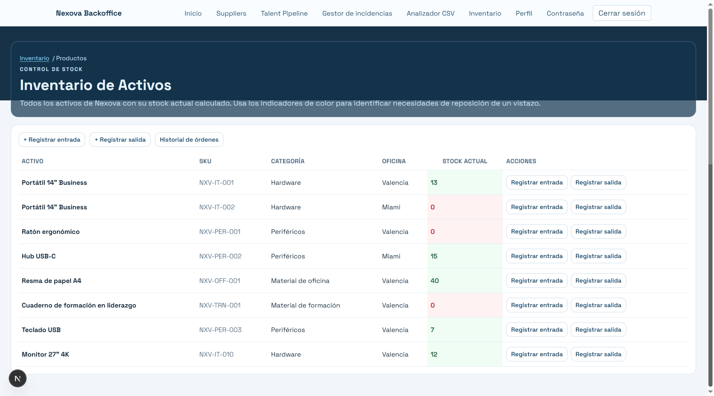

## Registrar orden de entrada a un producto

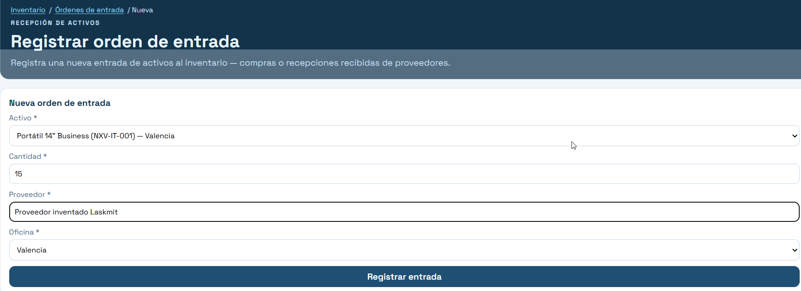

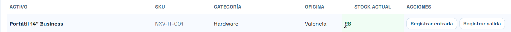

## Registrar orden de entrada con proveedor en blanco

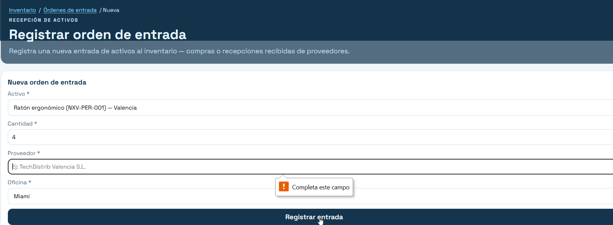

## Registrar orden de entrada cambiando la oficina

Le cambié la oficina y no dió el mensaje de error. Registró la orden pero por supuesto no actualizó el producto.  Debió dar error.  
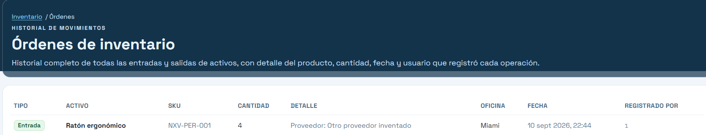

Se solicitó a la IA la emisión de un mensaje de error porque no está contemplado crear productos nuevos en el archivo por lo cual no se puede incluir unidades en locaciones donde no hay producto.
Corrección efectuada:
Si un producto pertenece a "Valencia" y se intenta registrar una orden con oficina "Miami", el backend rechaza la operación con HTTP 400.
En el frontend, al seleccionar un activo, la oficina se ajusta automáticamente y no se puede desincronizar por accidente.
No se registra ninguna orden si la oficina no coincide.

Se repite la prueba:
Intento de registro de una entrada cambiando la oficina a Valencia
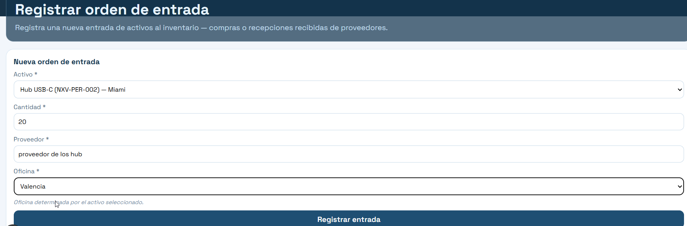

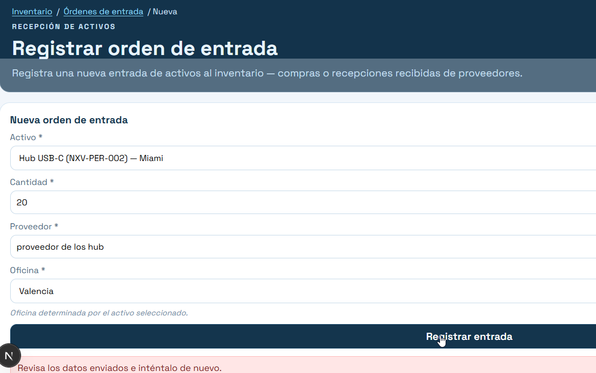

## Registrar una salida por mas cantidad de la existencia actual

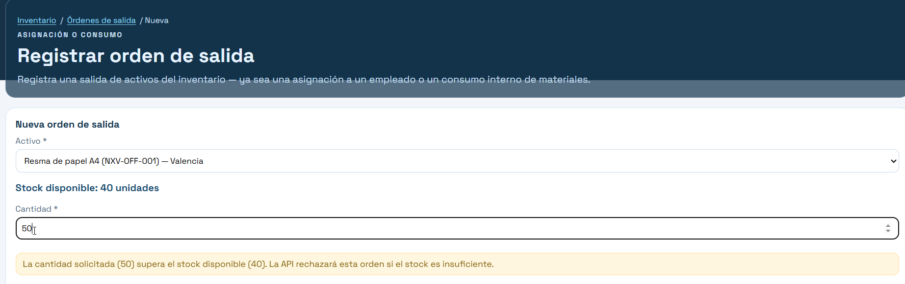

Luego le **cambié la oficina a la salida** y da el mensaje de error pero no es explícito
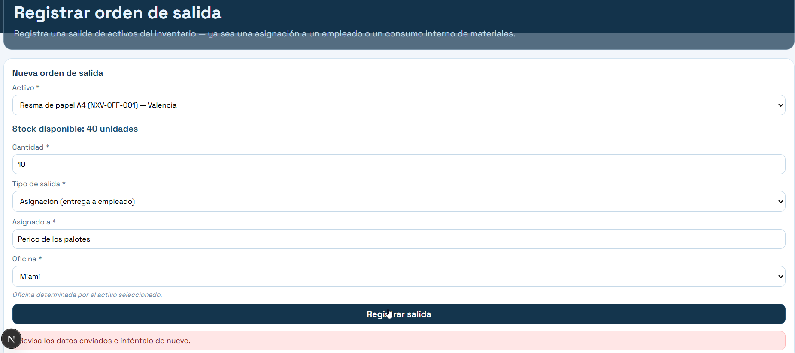

**Se solicita la siguiente modificación:**
Tanto en la orden de entrada como la de salida, cuando se le cambia la oficina, ahora da el error pero solo dice que revise los datos. en los dos casos, el error no es explícito, debe decir que ese producto no está en esa oficina. Ademas en el caso de la salida, se habia validado la cantidad contra la oficina anterior y luego dejó cambiar la oficina. Deberia validarse nuevamente la cantidad y decir que tiene que ser el mismo producto porque en el archivo cuando el mismo producto tiene otra oficina con existencias es otro SKU

Se repite la prueba y ahora no permite cambiar la oficina en la salida

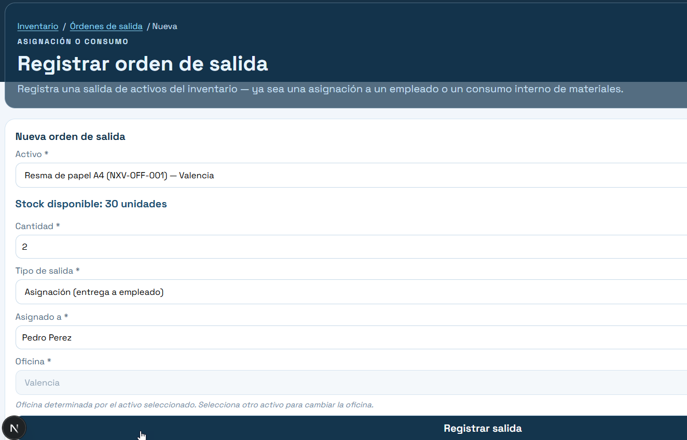

## Repetición de la prueba en la orden de entrada para que no deje cambiar la oficina

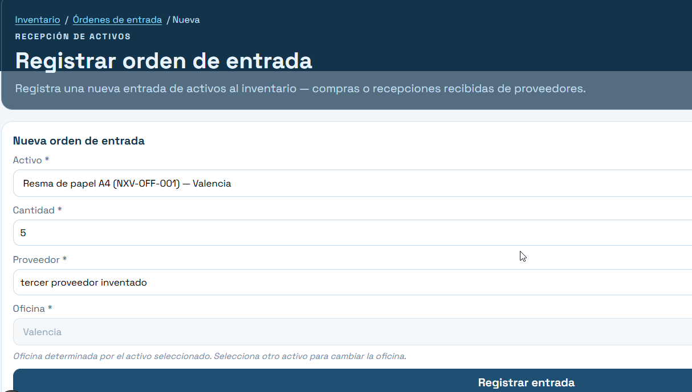

