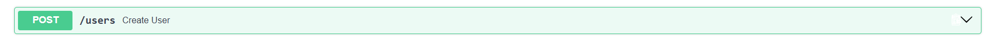
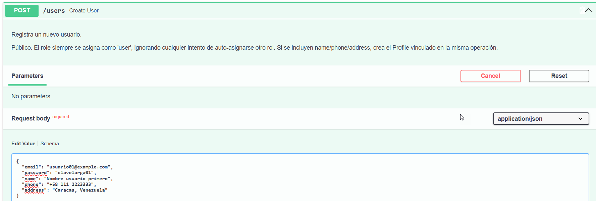
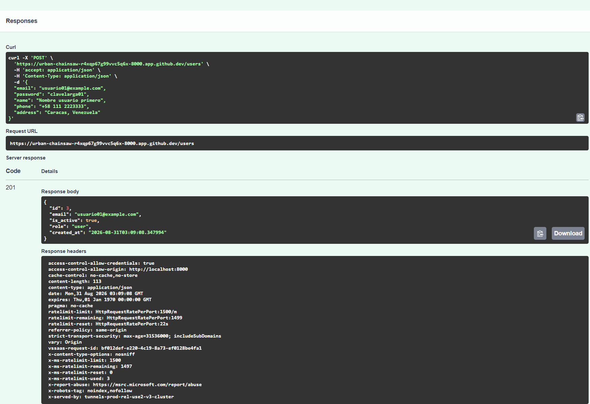
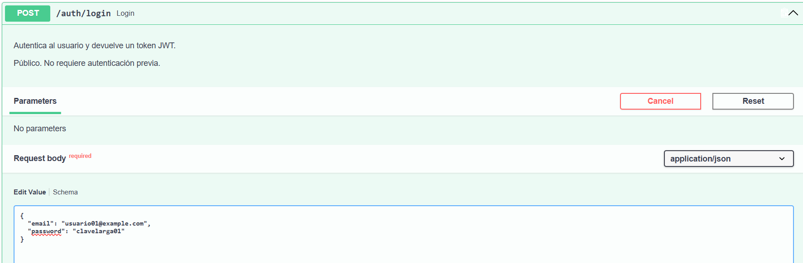
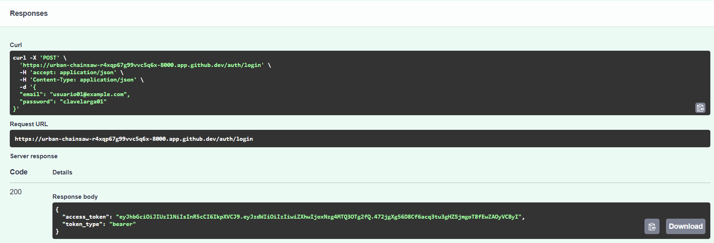
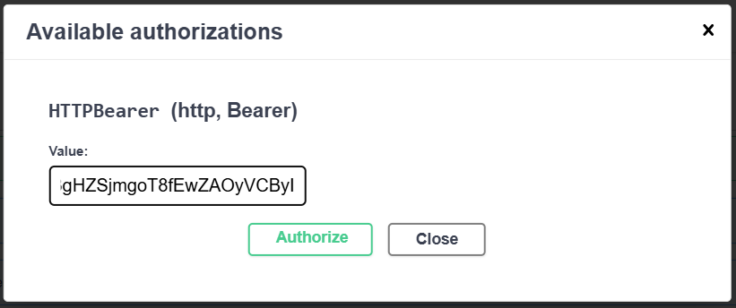
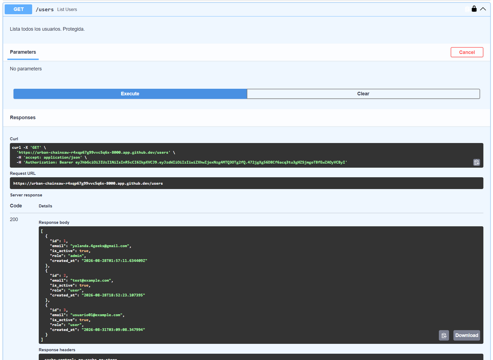
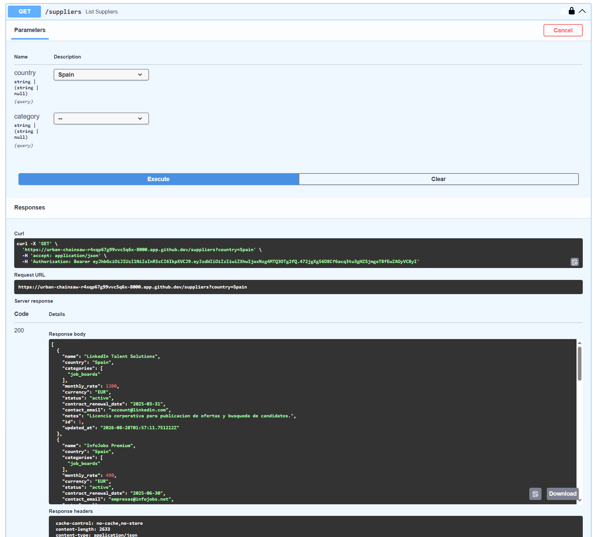
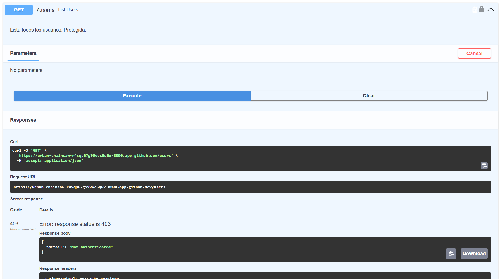
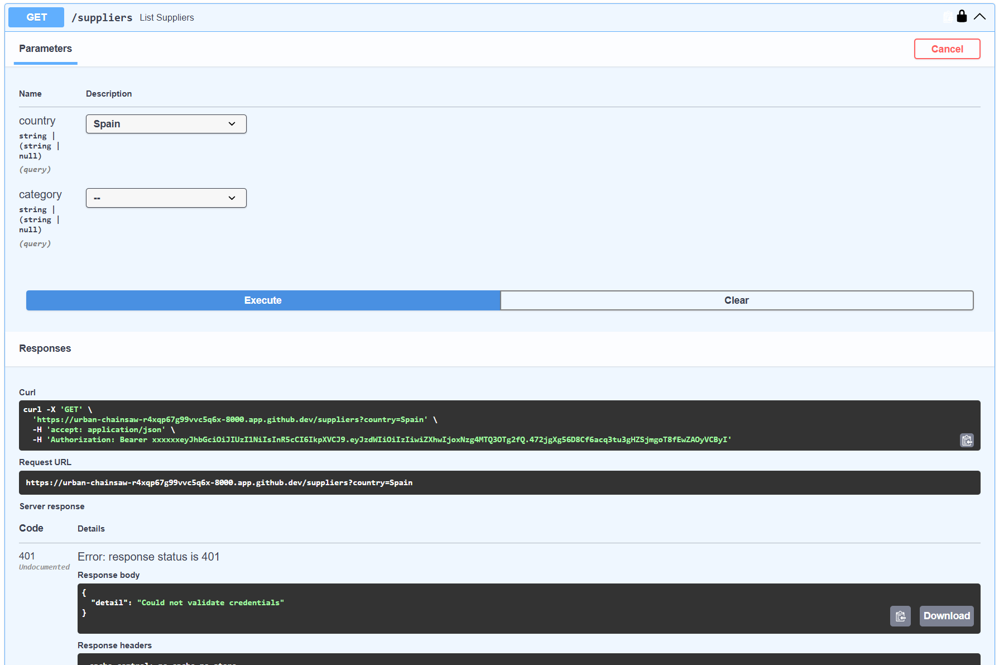

# Evidencias de las pruebas efectuadas en auth-api

## Crear usuario nuevo (nótese que está pública - sin candado)

## Login al usuario

OK. Devolvió el token correctamente

## Autorización enviando el token

![OK fué autorizado]](image-8.png)

OK. Autorización correcta usando el token devuelto por el login

## Listar usuarios existentes 

OK. Lista correctamente los usuarios porque el token está correcto

## Listar Suppliers

OK. Lista los proveedores porque el token está correcto.
Ahora: Se hizo logout en Authorize para probar los que son sin token

## Se intenta listar usuarios existentes, ahora sin token porque hicimos logout

ERROR:  Da error de autenticación porque no estamos autenticados

## Entré en Authorize pero le agregué unas xxxxx antes del token para enviar token malo

Luego tratando de listar nuevamente los proveedores

ERROR: Da error porque el token está mal formado (por las xxxxx)
