# Evidencia de validacion - Auth Frontend

Fecha: 2026-09-01
Rama: `auth-front`

## Validaciones automatizadas

- `npm run lint` en `uis/backoffice`: correcto, sin errores; permanece una advertencia preexistente en Talent Pipeline.
- `npm run build` en `uis/backoffice`: correcto; genera `/login`, `/register`, `/account/profile` y las rutas internas existentes.
- `npm run lint` en `uis/website`: correcto, sin errores; permanece una advertencia preexistente en `RegistroForm.tsx`.
- `npm run build` en `uis/website`: correcto; conserva unicamente sus rutas publicas.
- `git diff --check`: correcto.

## Matriz API observada

Prueba ejecutada contra FastAPI local en `http://localhost:8000` con un usuario temporal eliminado al terminar.

| Caso | Resultado observado |
|---|---|
| Registro valido con perfil | `POST /users` respondio `201` |
| Registro de email duplicado | `POST /users` respondio `422` |
| Login valido | `POST /auth/login` respondio `200` y emitio token |
| Consulta de cuenta | `GET /auth/me` con Bearer respondio `200` |
| Edicion de perfil | `PUT /profiles/me` con Bearer respondio `200` |
| Listado de proveedores | `GET /suppliers` con Bearer respondio `200` |
| Token alterado | `GET /auth/me` respondio `401` |
| Health publico de incidencias | `GET /api/incidents/health` sin token respondio `200` |
| Analisis multipart | `POST /api/incidents/analyze` con Bearer respondio `200` |
| Exportacion autenticada | `GET /api/incidents/results/export` con Bearer respondio `200` |

## Comprobaciones estaticas

- Las llamadas Nexova de Suppliers e Incidents pasan por `lib/api-client.ts`.
- La carga multipart no establece manualmente `Content-Type`.
- La exportacion solicita un `Blob`, dispara una descarga temporal y revoca su URL.
- Talent Pipeline conserva su cliente externo y no importa el JWT de Nexova.
- `uis/website` no contiene la guarda ni utilidades de autenticacion.

## Pendiente manual en navegador

Requiere interaccion humana para confirmar foco visible, navegacion con teclado, ausencia de desbordes en distintos viewports y comportamiento del historial tras logout. La vista de login se comprobo disponible con HTTP `200` en `http://localhost:3000/login`.

## Relación de pruebas efectuadas en navegador directamente por usuario

1. **Redirección inicial de una ruta protegida**
	- Sin iniciar sesión, abrir directamente `http://localhost:3000/`.
	- Se confirma que aparece el mensaje: Comprobando sesión.  La aplicación redirige directamente al formulario de  `/login` o creación de usuario.
	- Al cambiar el URL a los siguientes, se mantiene la redirección a LOGIN: `/suppliers`, `/incidents-analyzer`, `/talent-pipeline-tracker` y `/account/profile`.
	- **Evidencia:** 
    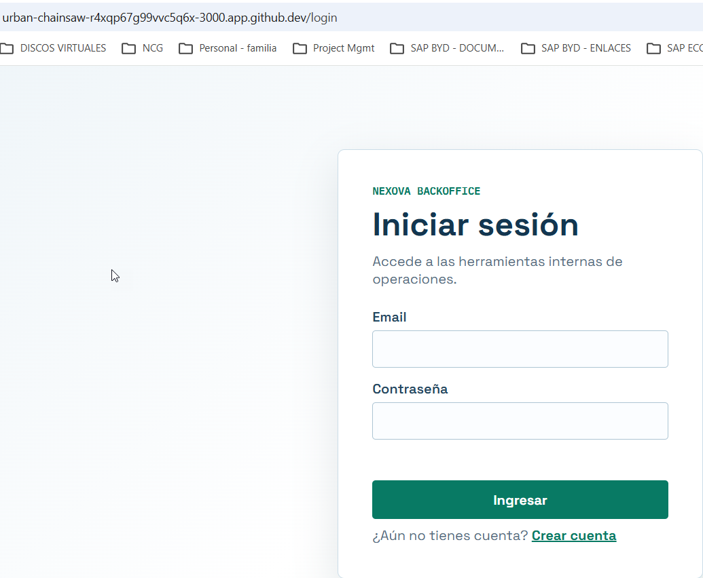

2. **Navegación pública entre login y registro**
	- En `/login`, la única navegación posible es para ir a crear cuenta. (ver imagen anterior)
	- Se entra a registrar un nuevo usuario.  Se comprueba que abre el formulario `/register` y se registra el usuario.
    - **Evidencia:**
    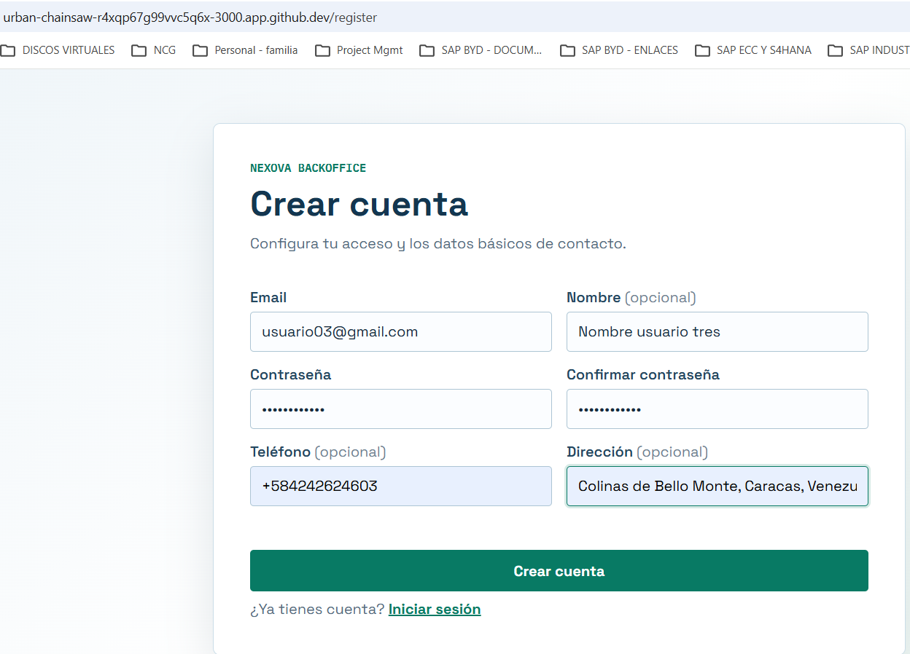
    Al registrar el usuario de forma exitosa, se redirecciona directamente al: Panel interno de Talent Pipeline
    - **Evidencia:**
    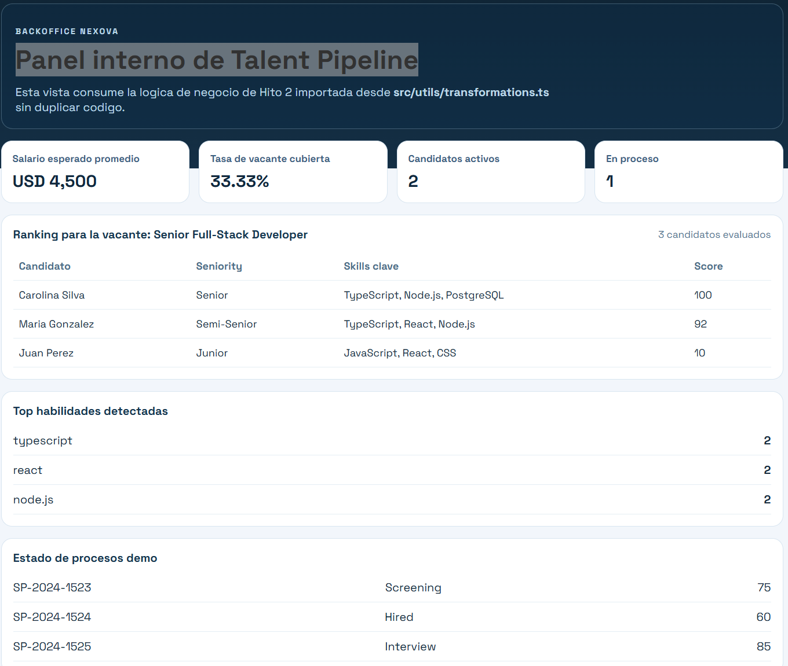
    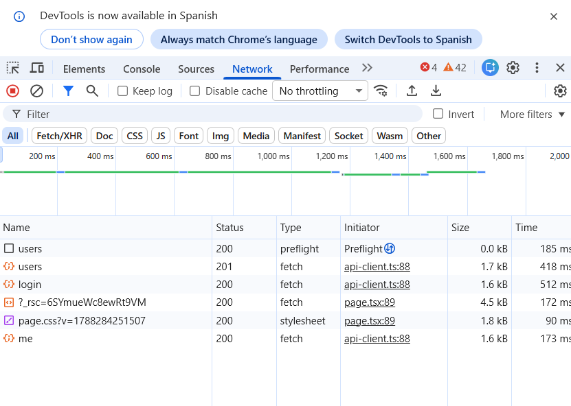
    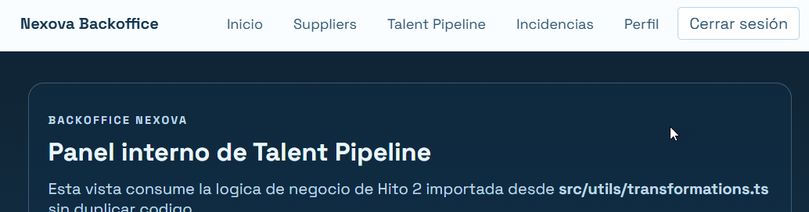
    - Se cierra sesión en el panel interno para probar validaciones con errores en el registro de usuario nuevo:

3. **Validaciones locales del registro**
	- En `/register`, se intenta enviar errores en el formulario.  Salen los mensajes de error en cada campo y el cursor se posiciona en el primer campo con errores:
    - **Evidencia:**
   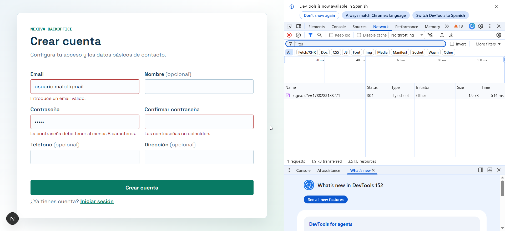
	- En inspeccionar, **Network** no se visualiza la inclusión del nuevo usuario.

4. **Visualización del perfil**
	- Botón perfil para visualizar el formulario de datos del usuario
    - **Evidencia:**
    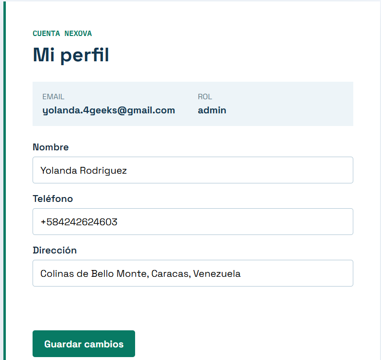

5. **Persistencia de la sesión y bloqueo de páginas públicas**
    - Se abre una nueva ventana con la misma URL y se confirma que la sesión se mantiene abierta.
    - ocurre lo mismo al refrescar la página
    - **Evidencia:** 
    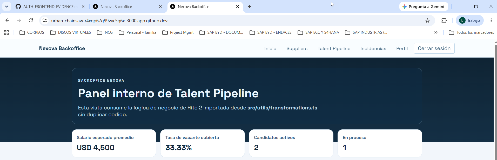

7. **Operaciones autenticadas de Suppliers**
	- Se abre la vista de  `/suppliers` y se confirma que carga correctamente y funcionan bien los filtros.
    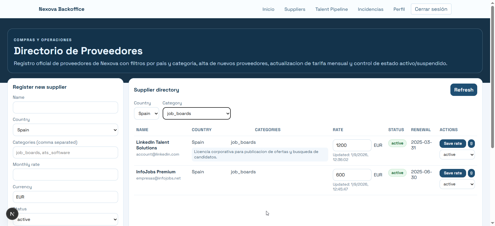
    - Se crea este proveedor para comprobar la funcionalidad de agregar proveedores:
    
    - verificación en NETWORK para la creación de proveedores:
    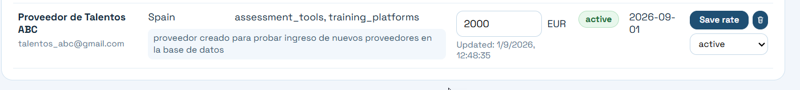

8. **Análisis y exportación autenticada de incidencias**
	- Corriendo el analizador de incidencias :
    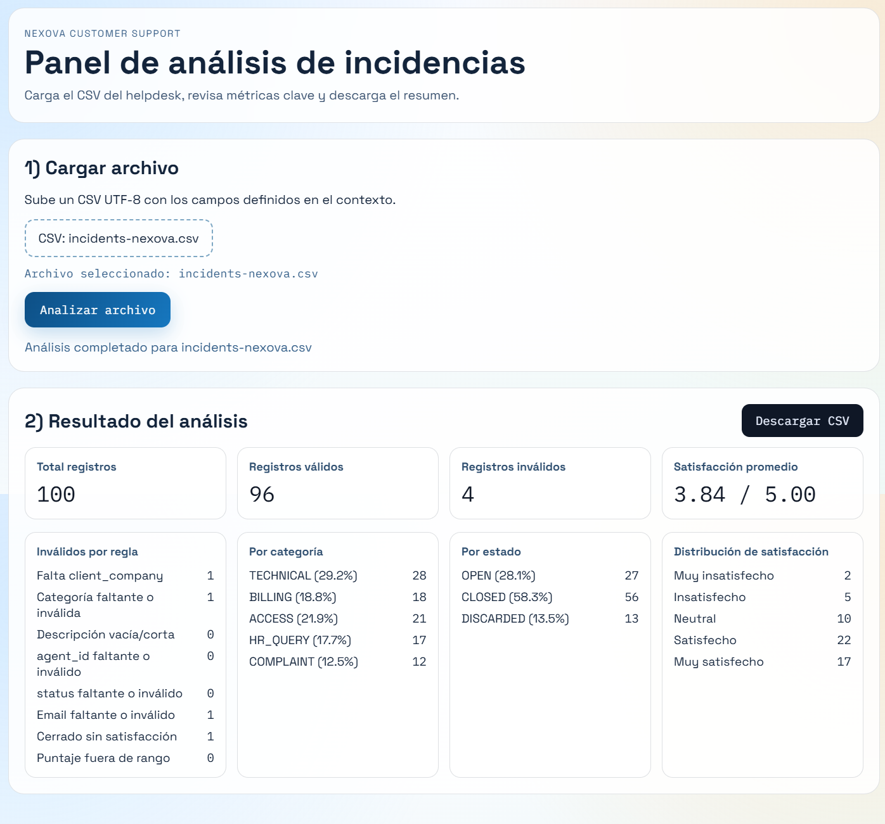
    - Exportacion visualizada en Network
    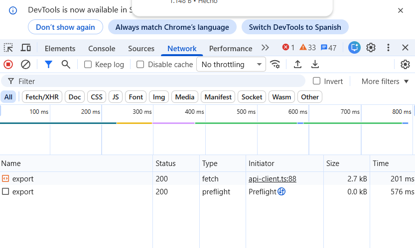
    - vista parcial del archivo exportado con datos
    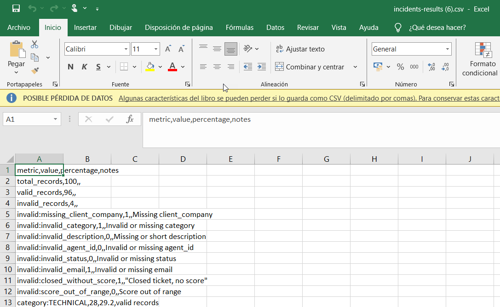

9. **Acceso protegido a Talent Pipeline Tracker**
	- Se abre `/talent-pipeline-tracker` y, se visualiza un candidato, se le modificó la etapa a "Entrevista personal" y lo hizo correctamente.  Se muestra el detalle de la persona.
    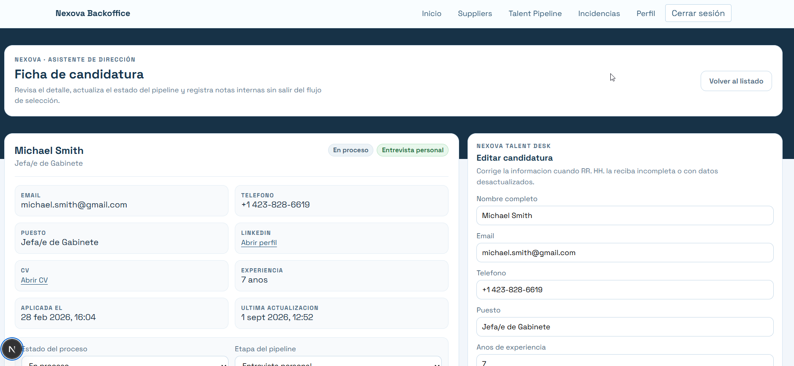
    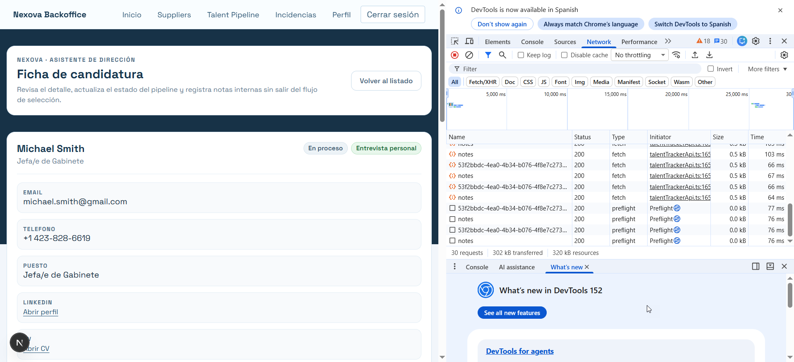

10. **Cierre de sesión e historial del navegador**
    - Local Storage mientras se tiene Sesión abierta:
    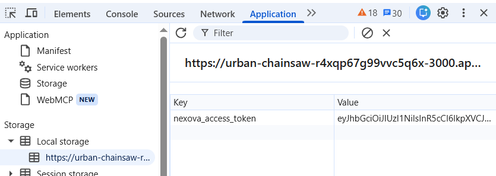
    - Local Storage luego de cerrar sesión
    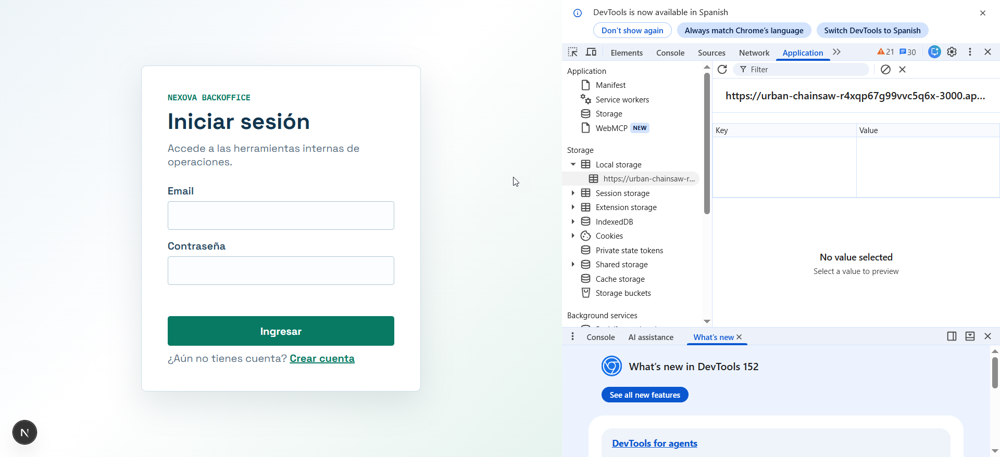
    
13. **Intento de registro con email duplicado**
    - Intento con correo que ya existe:
    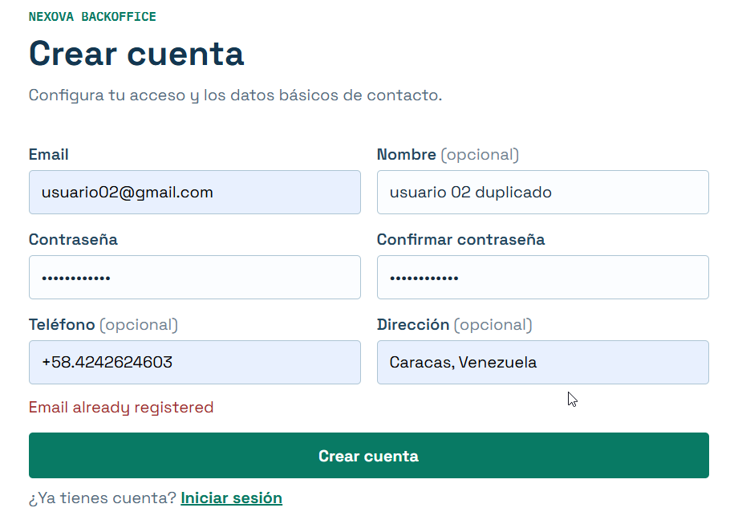

