# Evidencias de pruebas manuales - Auth Restablecimiento de Password

Rama: `auth-password`

## Objetivo

Demostrar el funcionamiento de AUTH-Restablecimiento de password

- Solicitud de recuperacion de contrasena sin revelar si un usuario existe.
- Restablecimiento mediante un enlace enviado por Resend.
- Cambio de contrasena desde una sesion autenticada.
- Conservacion de las funciones existentes de autenticacion y del backoffice.

# EVIDENCIA DE LAS PRUEBAS

## Prueba 1 - Enlace de recuperacion en formulario de LOGIN - Procesar Olvidé mi contraseña

Al abrir la aplicación, aparece la página de LOGIN.  Se presiona en el enlace **¿Olvidaste tu contrasena?**.
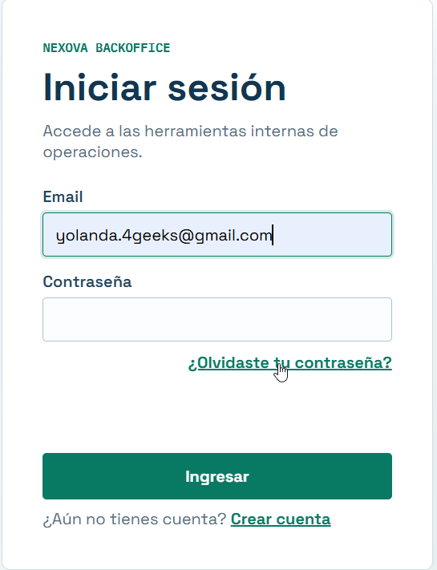

Se confirmar que abre `/forgot-password` sin exigir autenticacion.
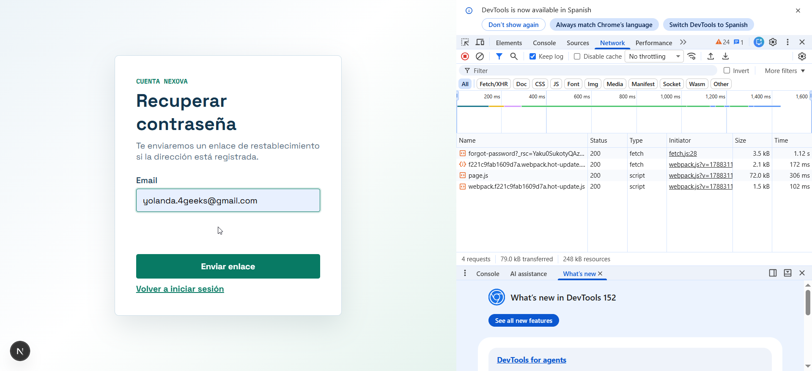

Se introduce el correo y se envia la solicitud para que mande el correo
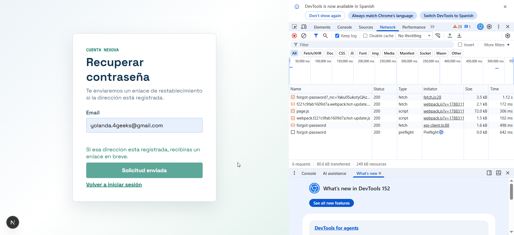

Correos que han sido enviados por el RESEND:
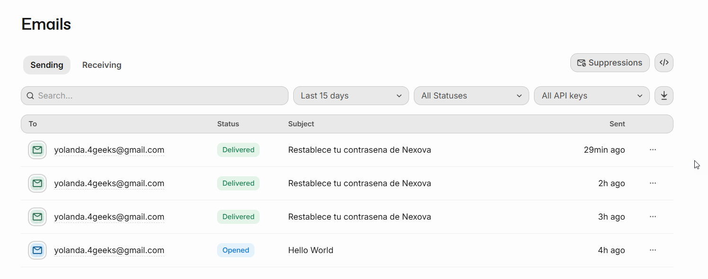

Correo recibido por el usuario:
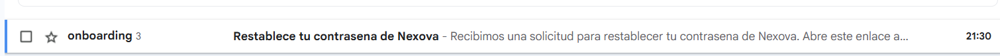

Al abrir el correo se aprecia el enlace:
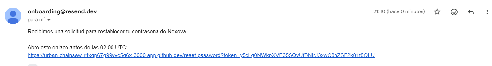

El enlace lleva a la definición de la nueva cotraseña:
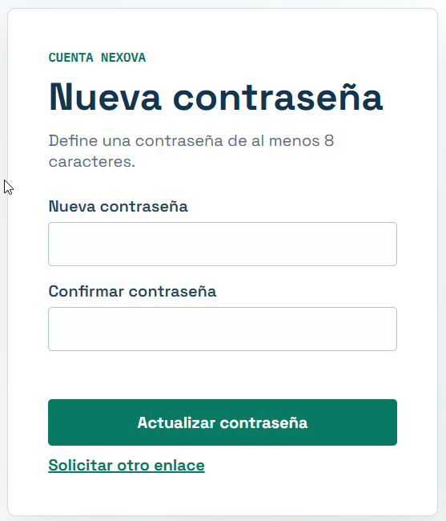

Actualizar contraseña:
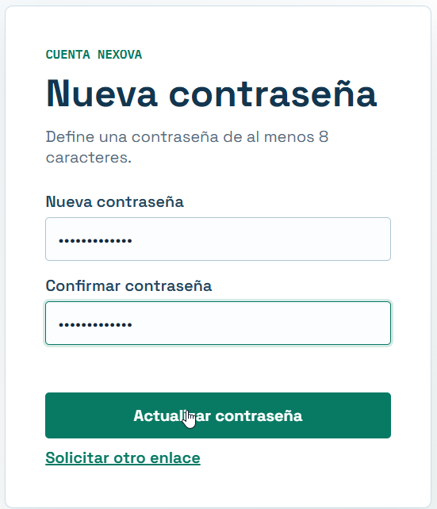

Contraseña correctamente actualizada, permite iniciar sesión
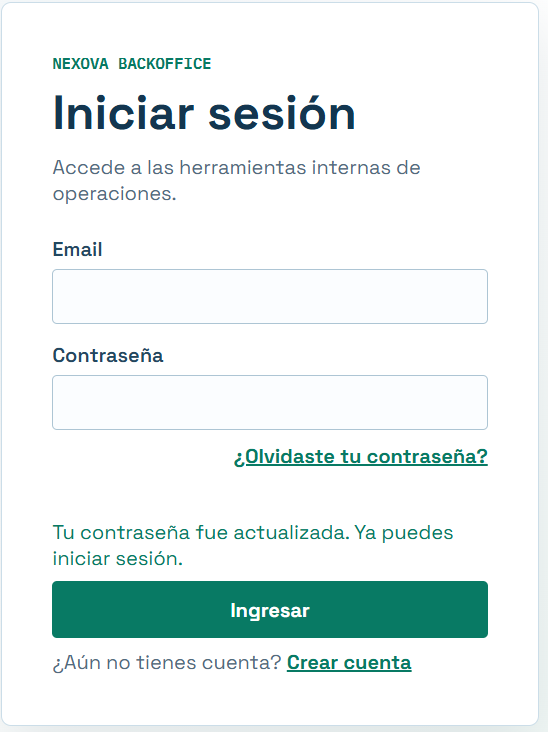

Al dar LOGIN, entra en la parte protegida
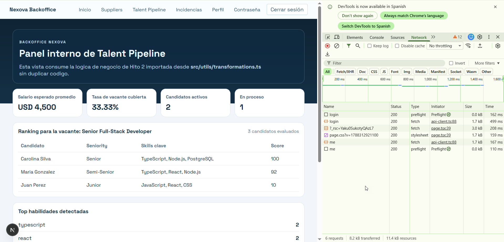

## Prueba 2 - Validacion local del email

En recuperar contraseña, colocamos un correo incorrecto:
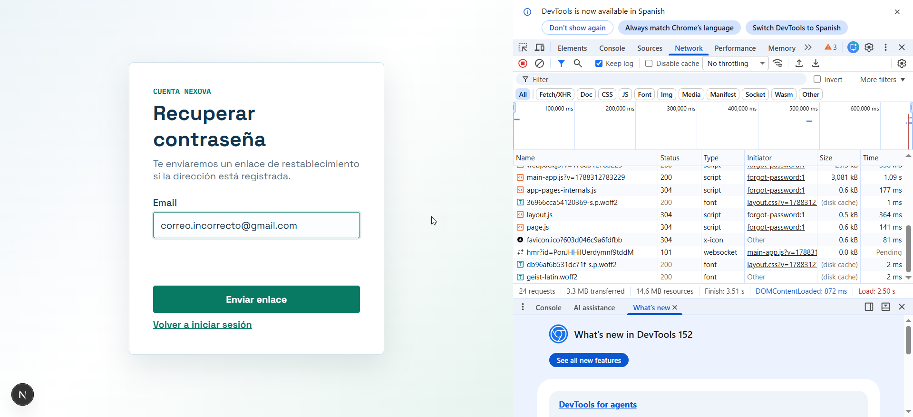

Se envia la solicitud pero la aplicación no dice que el correo está incorrecto. Solo indica con un mensaje que si el correo existe, se enviará el correo
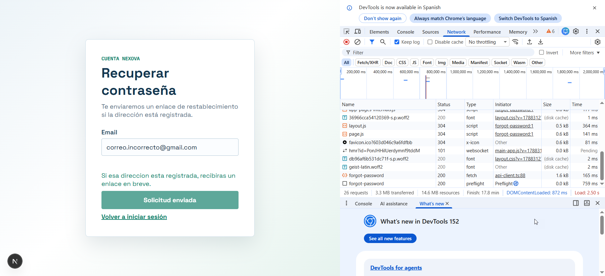

En caso de que se deje en blanco el correo, la aplicación si devuelve un error

Enviando un texto que no es un correo
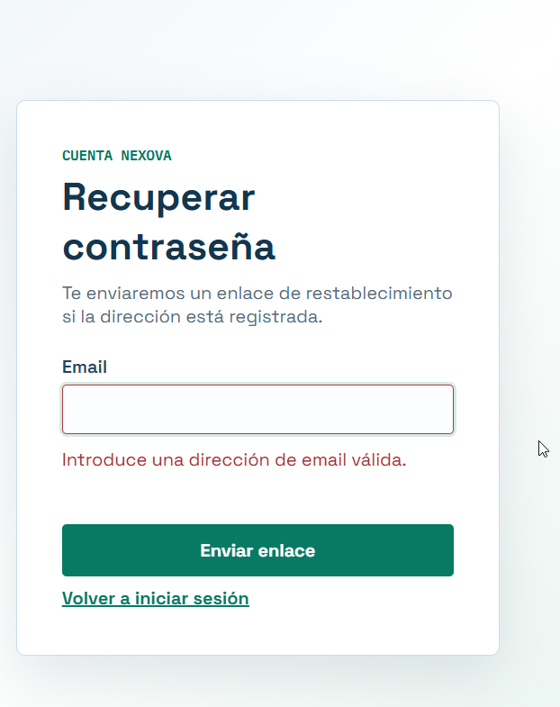

## Prueba 3 - Proteccion contra enumeracion de usuarios

Se introduce un email correcto pero es un usuario que no está creado en la aplicación
La aplicación responde igual que antes, para que no se sepa que el usuario no existe
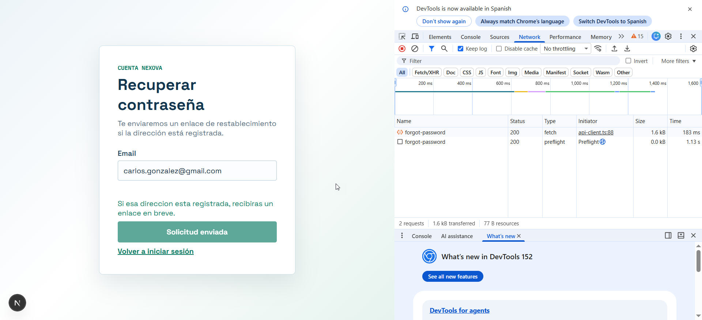

Nota: Resend no envió ningun correo

## Prueba 4 - Usuario activo quiere cambiar su contrasena

Recargué la página. Se ve que en network llamó a ME para verificar usuario activo.
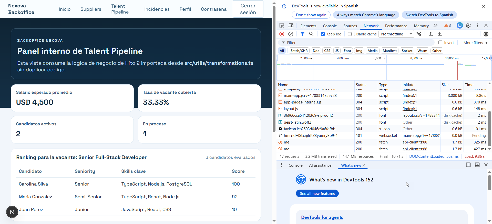

Usuario presiona botón de Contraseña para cambiarla
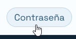

Se carga formulario para introducir contraseña
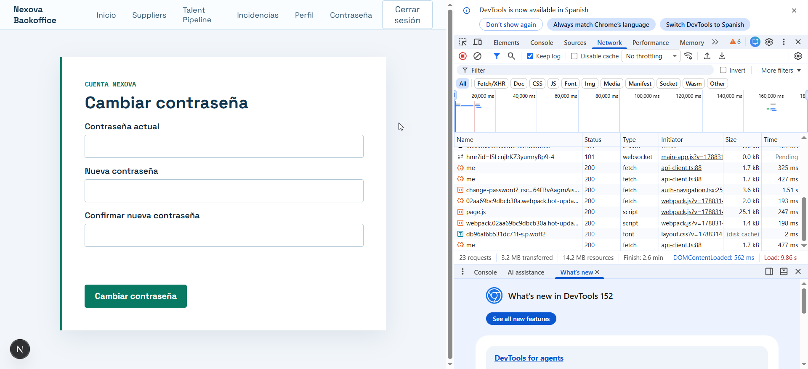

Se introducen contraseñas diferentes en el formulario:

Se introducen contraseñas de menos de 8 caracteres
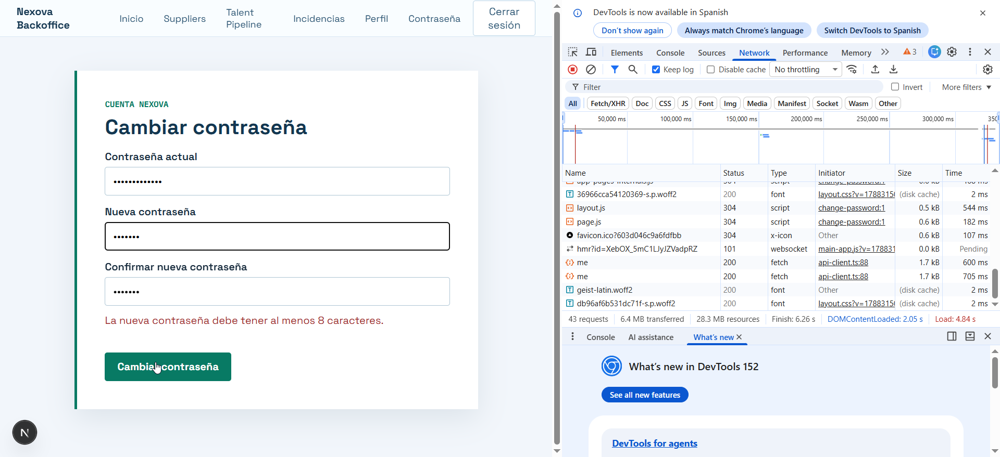

Se introduce la contraseña actual incorrecta
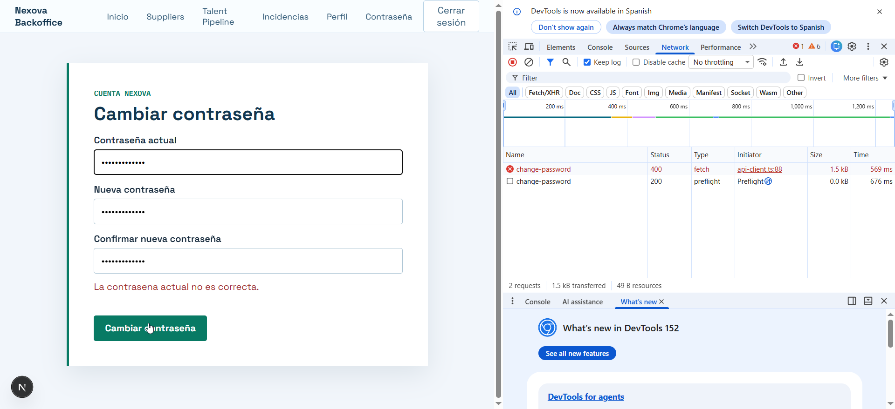

Todos los datos correctos:
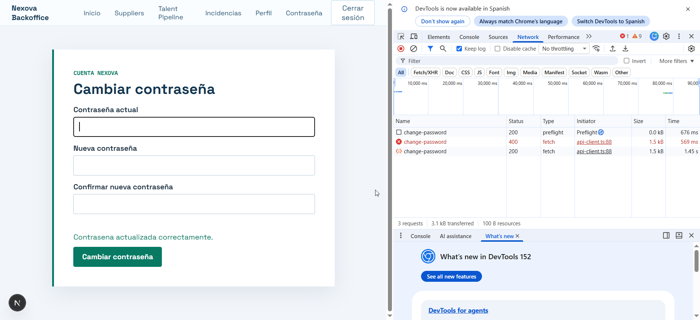

## Prueba 5 - Usuario activo - tiene token y se esconde por sensible

Se muestra usuario activo en uno de los formularios con token activo
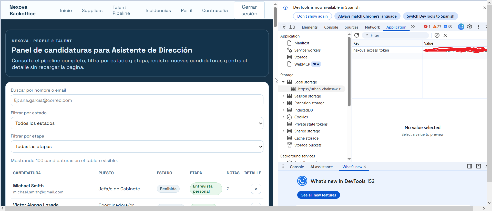

## Prueba 6 - Usuario quiere entrar con clave incorrecta

Se le emite el mensaje de error (usuario o clave incorrectos)
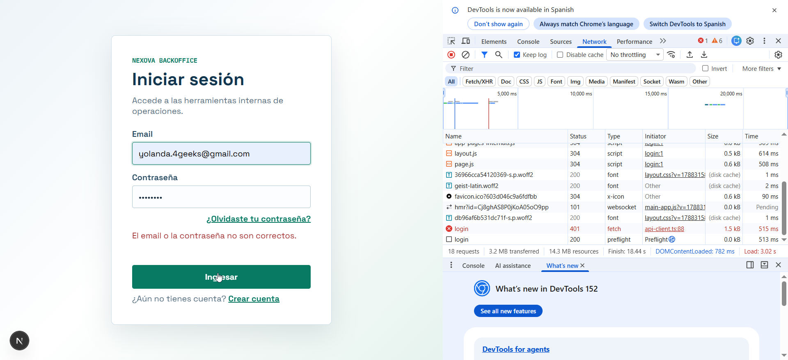

