# Evidencia pruebas efectuadas - centralized-incident-manager

## Indicadores en panel de resumen luego de la ejecución del seed
Se nota que está de acuerdo a lo indicado en el contexto de la empresa
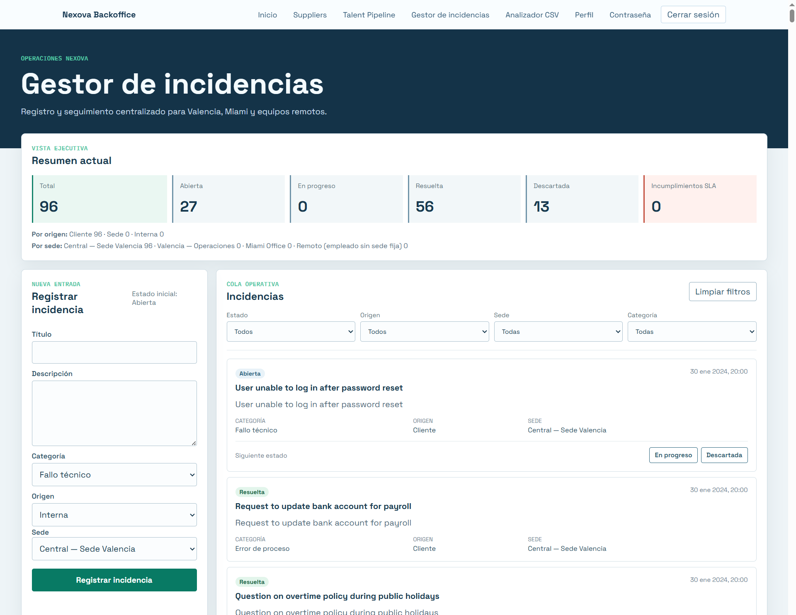

## Segunda corrida del seed para demostrar que no se registran las incidencias duplicadas:
**Comando para correr el seed nuevamente:**
   PYTHONPATH=. uv --project services/api run python scripts/seed_incidents.py
**Resultado de la corrida:**
Installed 1 package in 17ms
Filas leidas: 100
Filas validas: 96
Filas insertadas: 0
Filas omitidas: 96
Filas descartadas: 4
Motivos de descarte:
- closed_without_score: 1
- invalid_category: 1
- invalid_email: 1
- missing_client_company: 1

## Muestra de los estados permitidos para cambiar
Abierta: notar los botones para cambiar a estados en progreso, descartada.
Resuelta o Descartada: no se muestran botones para cambio
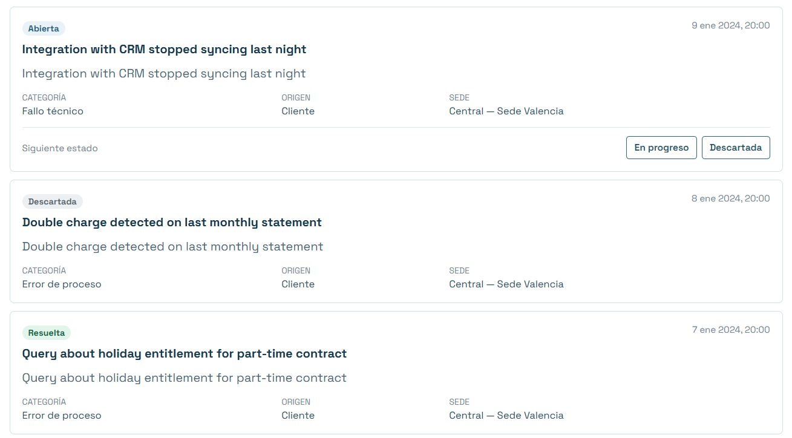

## Prueba de Filtros
Se filtra por estado abiertas y solo categoria error de Proceso
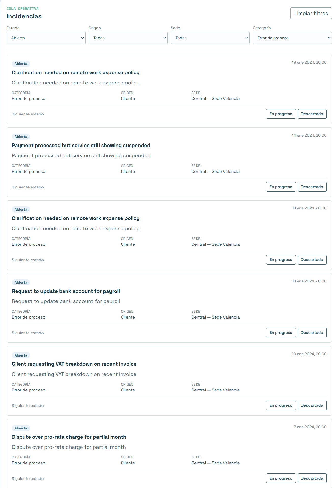

## Creación de una nueva incidencia
Datos introducidos:
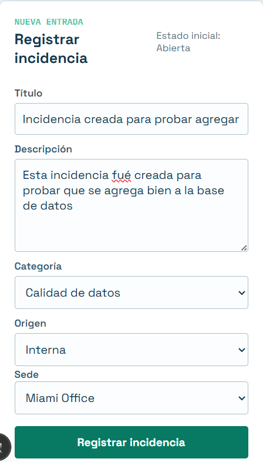

En el listado se aprecia la incidencia que acaba de crearse.  Queda automáticamente en Abierta
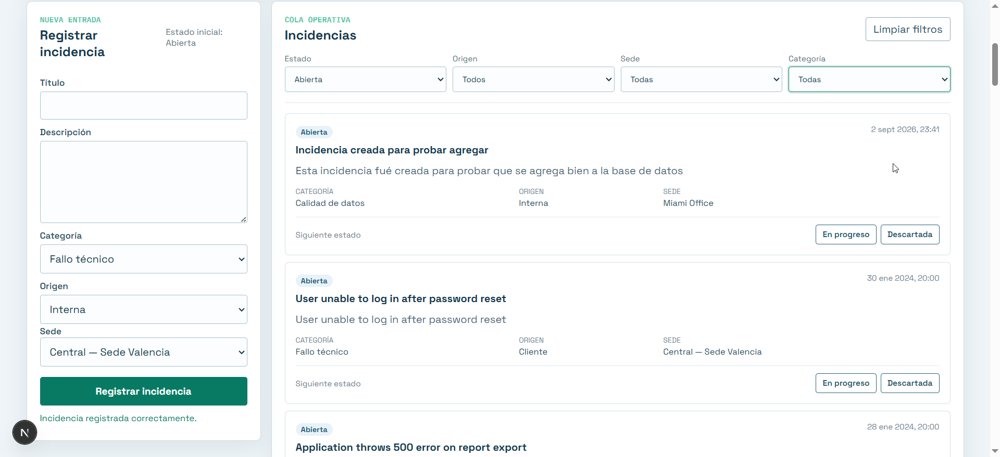

## Cambio de Estado a la incidencia
Se hizo cambio de estado desde Abierta, a En Progreso
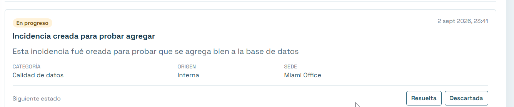
Nótese que ahora puede ser cambiada a Resuelta o a Descartada porque está en Progreso

## Filtrando por Sede, ahora sale la incidencia que acabamos de crear en Miami
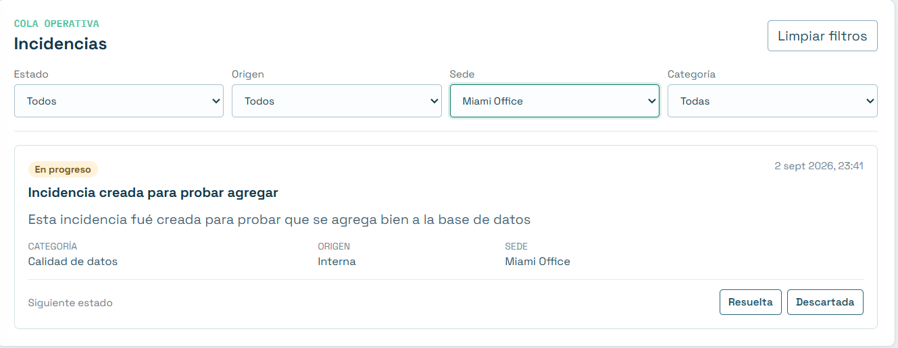

## Botón LIMPIAR FILTROS, vuelve a mostrar todas las incidencias
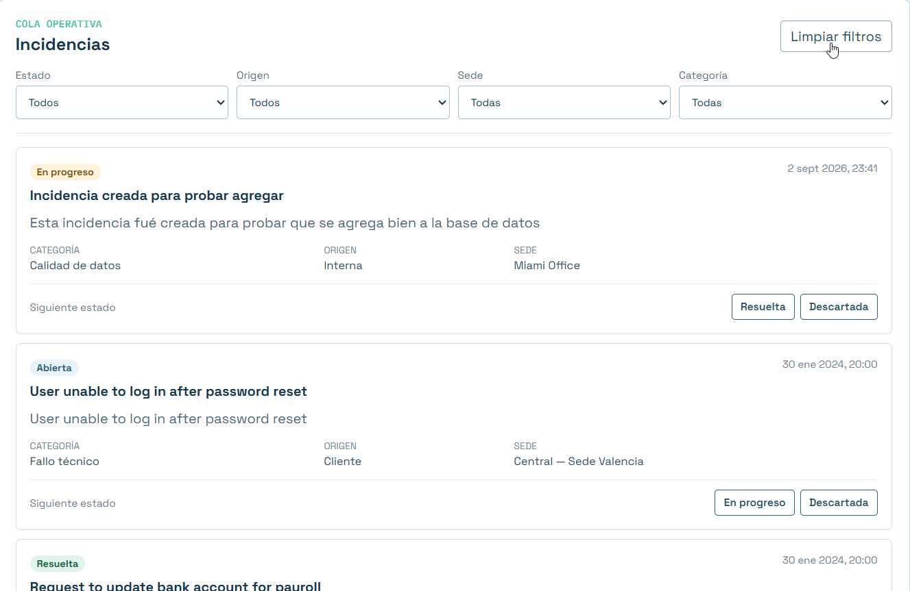

## Actividad en NETWORK al solicitar filtros - notese que se buscan las abiertas
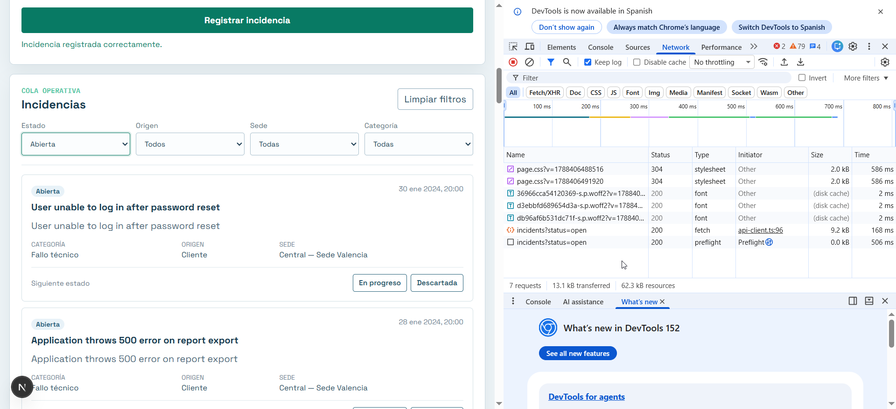

## Actividad en NETWORK al llamar a la API sin filtros - se buscan todas
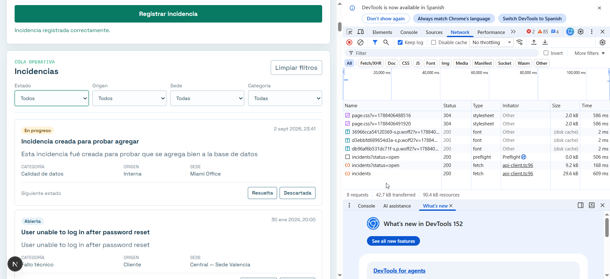

## Formulario de registro de incidencia mostrando error de validación
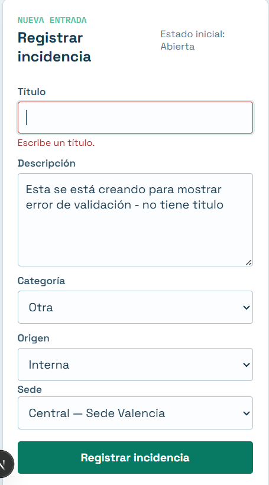

## Puerto se coloca con visibilidad privada para que falle la llamada a la API
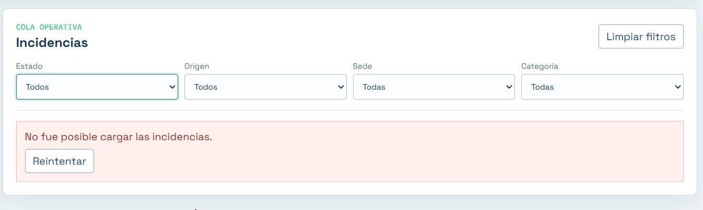

## Talent Pipeline sigue funcionando correctamente como antes
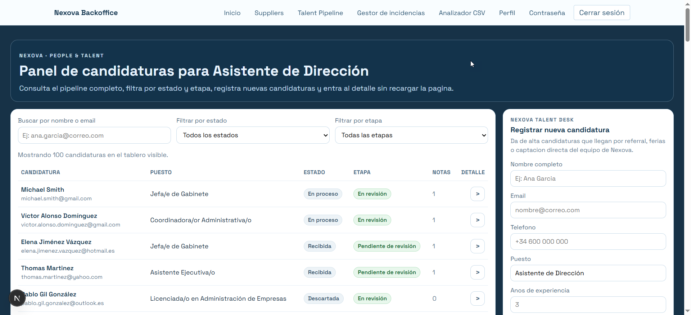

## Panel interno de Talent Pipeline sigue funcionando igual
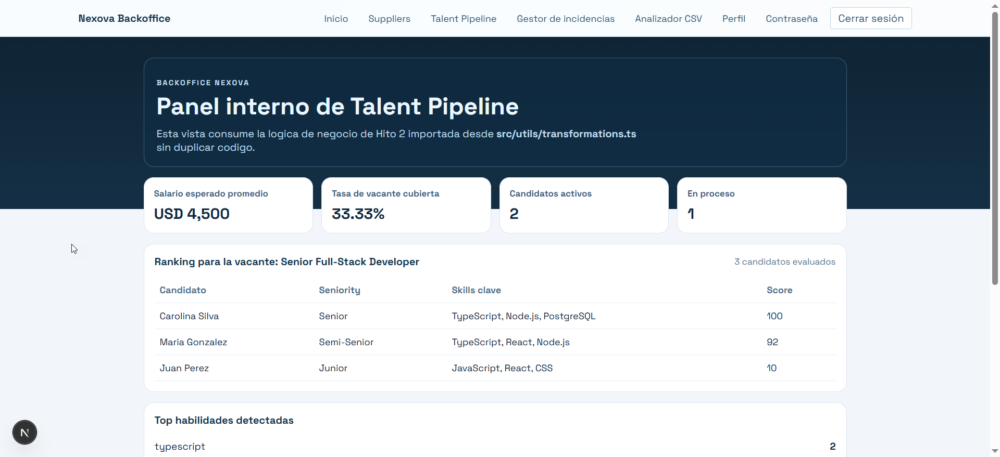

## Suppliers sigue funcionando correctamente como antes
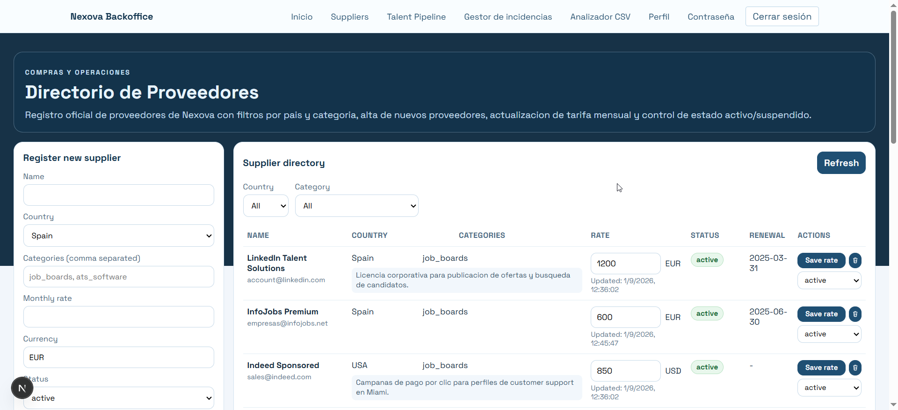

## Sitio web público funcionando correctamente
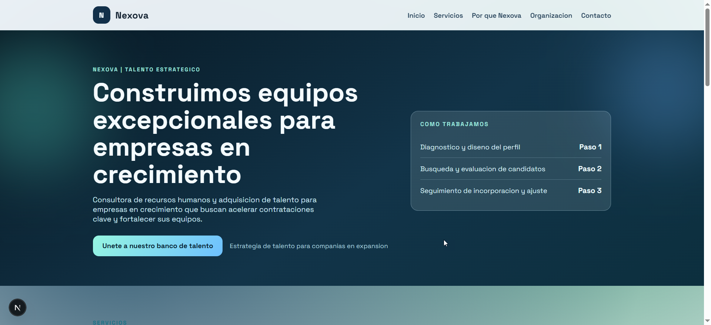

