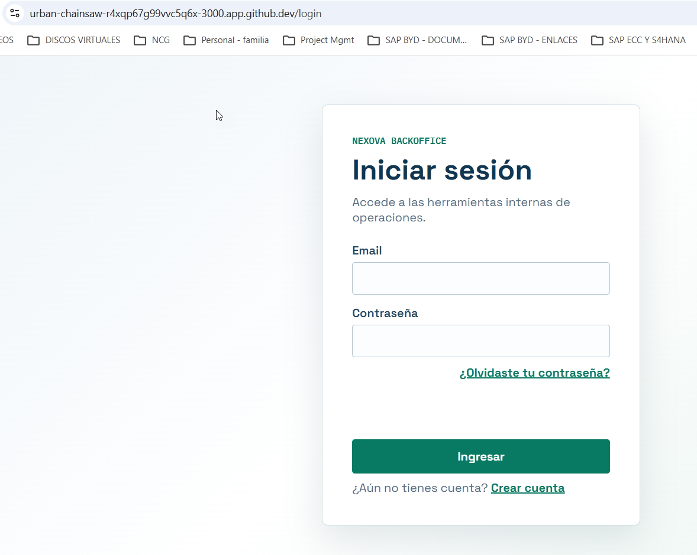
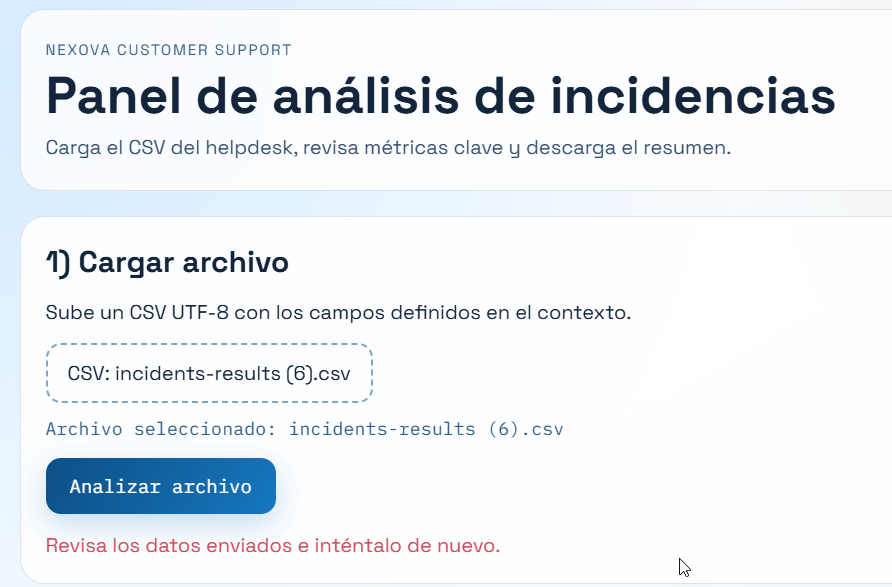
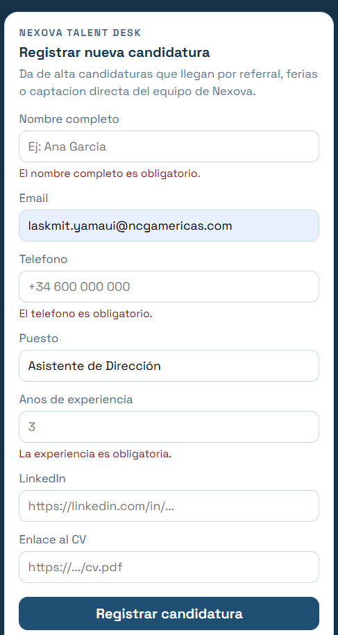
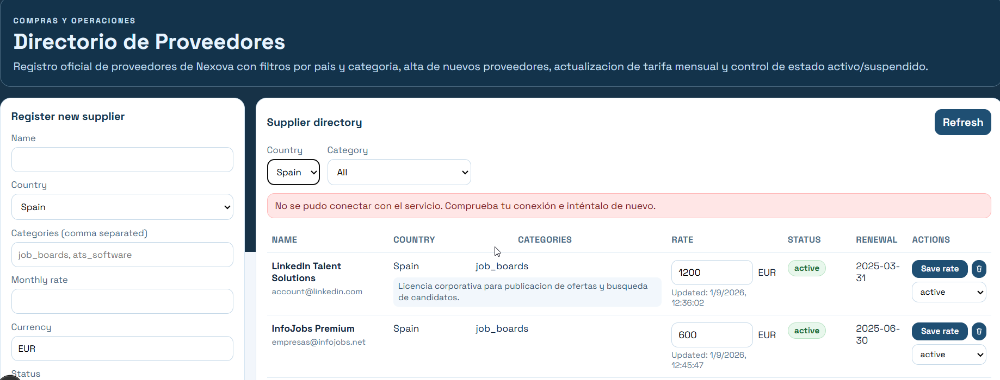
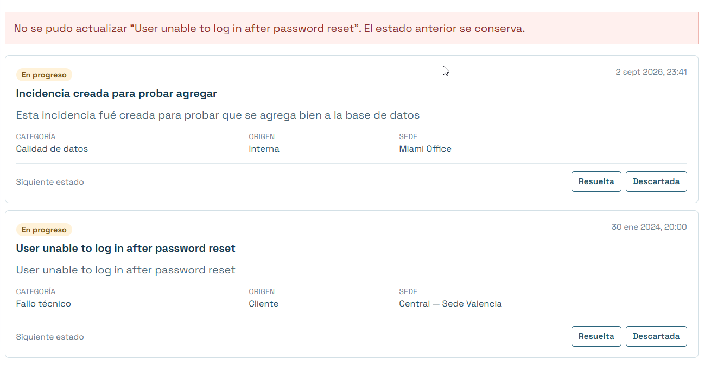
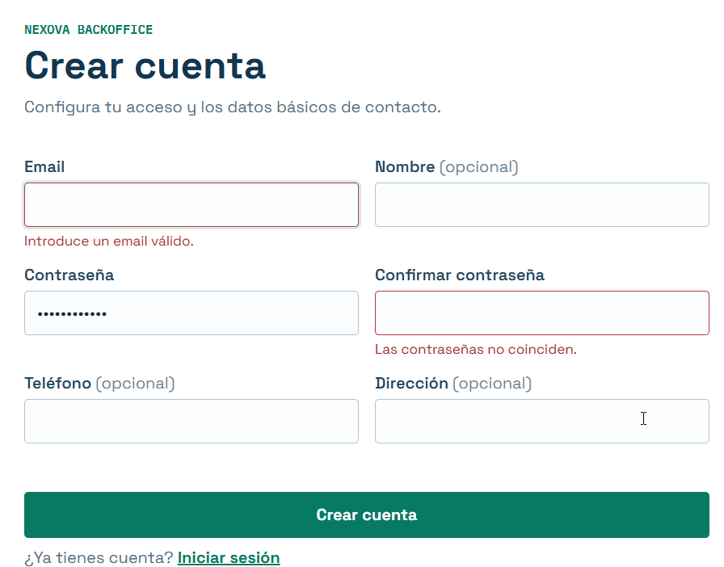
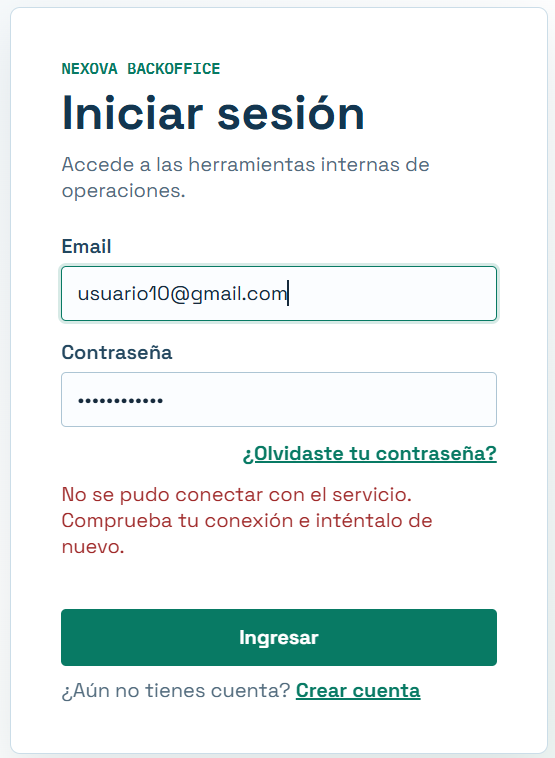

# Evidencia pruebas manuales en manejo de errores

## Entrar en una ruta protegida con el servidor apagado (puerto 8000 privado)

## Se intenta hacer analisis de incidencias con un csv errado

## Se intenta registrar candidatura con campos en blanco

## Se intenta listar proveedores con el puerto 8000 en privado

## Tratando de cambiar el estado a una incidencia, con el puerto apagado

## intentando crear cuenta con campos en blanco

## Iniciando sesión con el puerto en privado

